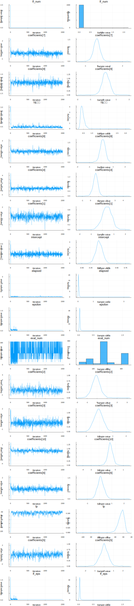

## Linear Regression

### Added snippet used as a reference for all models

This model is based on the TuringTutorial example [LinearRegression](https://github.com/TuringLang/TuringTutorials/blob/csp/linear/LinearRegression.ipynb) by Cameron Pfiffer.

Turing is powerful when applied to complex hierarchical models, but it can also be put to task at common statistical procedures, like linear regression. This tutorial covers how to implement a linear regression model in Turing.

We begin by importing all the necessary libraries.

Import StratisticalRethinking.


```julia
using StatisticalRethinking, GLM
```

    loaded


    ┌ Warning: Package Turing does not have CmdStan in its dependencies:
    │ - If you have Turing checked out for development and have
    │   added CmdStan as a dependency but haven't updated your primary
    │   environment's manifest file, try `Pkg.resolve()`.
    │ - Otherwise you may need to report an issue with Turing
    │ Loading CmdStan into Turing from project dependency, future warnings for Turing are suppressed.
    └ @ nothing nothing:840
    WARNING: using CmdStan.Sample in module Turing conflicts with an existing identifier.


Hide the progress prompt while sampling.


```julia
Turing.turnprogress(false);
```

    ┌ Info: [Turing]: global PROGRESS is set as false
    └ @ Turing /Users/rob/.julia/packages/Turing/pRhjG/src/Turing.jl:81


We will use the mtcars dataset from the RDatasets package. mtcars contains a variety of statistics on different car models, including their miles per gallon, number of cylinders, and horsepower, among others.

We want to know if we can construct a Bayesian linear regression model to predict the miles per gallon of a car, given the other statistics it has. Lets take a look at the data we have.

Import the dataset.


```julia
data = RDatasets.dataset("datasets", "mtcars");
```

Show the first six rows of the dataset.


```julia
first(data, 6)
```


<table class="data-frame"><thead><tr><th></th><th>Model</th><th>MPG</th><th>Cyl</th><th>Disp</th><th>HP</th><th>DRat</th><th>WT</th><th>QSec</th><th>VS</th><th>AM</th><th>Gear</th><th>Carb</th></tr><tr><th></th><th>String⍰</th><th>Float64⍰</th><th>Int64⍰</th><th>Float64⍰</th><th>Int64⍰</th><th>Float64⍰</th><th>Float64⍰</th><th>Float64⍰</th><th>Int64⍰</th><th>Int64⍰</th><th>Int64⍰</th><th>Int64⍰</th></tr></thead><tbody><p>6 rows × 12 columns</p><tr><th>1</th><td>Mazda RX4</td><td>21.0</td><td>6</td><td>160.0</td><td>110</td><td>3.9</td><td>2.62</td><td>16.46</td><td>0</td><td>1</td><td>4</td><td>4</td></tr><tr><th>2</th><td>Mazda RX4 Wag</td><td>21.0</td><td>6</td><td>160.0</td><td>110</td><td>3.9</td><td>2.875</td><td>17.02</td><td>0</td><td>1</td><td>4</td><td>4</td></tr><tr><th>3</th><td>Datsun 710</td><td>22.8</td><td>4</td><td>108.0</td><td>93</td><td>3.85</td><td>2.32</td><td>18.61</td><td>1</td><td>1</td><td>4</td><td>1</td></tr><tr><th>4</th><td>Hornet 4 Drive</td><td>21.4</td><td>6</td><td>258.0</td><td>110</td><td>3.08</td><td>3.215</td><td>19.44</td><td>1</td><td>0</td><td>3</td><td>1</td></tr><tr><th>5</th><td>Hornet Sportabout</td><td>18.7</td><td>8</td><td>360.0</td><td>175</td><td>3.15</td><td>3.44</td><td>17.02</td><td>0</td><td>0</td><td>3</td><td>2</td></tr><tr><th>6</th><td>Valiant</td><td>18.1</td><td>6</td><td>225.0</td><td>105</td><td>2.76</td><td>3.46</td><td>20.22</td><td>1</td><td>0</td><td>3</td><td>1</td></tr></tbody></table>


The next step is to get our data ready for testing. We'll split the mtcars dataset into two subsets, one for training our model and one for evaluating our model. Then, we separate the labels we want to learn (MPG, in this case) and standardize the datasets by subtracting each column's means and dividing by the standard deviation of that column.

The resulting data is not very familiar looking, but this standardization process helps the sampler converge far easier. We also create a function called unstandardize, which returns the standardized values to their original form. We will use this function later on when we make predictions.

Split our dataset 70%/30% into training/test sets.


```julia
train, test = MLDataUtils.splitobs(data, at = 0.7);
```

    ┌ Warning: `view(adf, x)` will select all rows and columns `x` from `adf` in the future. Use `view(adf, x, :)` to select rows `x` and all columns from `adf` instead.
    │   caller = datasubset at datapattern.jl:10 [inlined]
    └ @ Core /Users/rob/.julia/dev/MLDataUtils/src/datapattern.jl:10
    ┌ Warning: `view(adf, x)` will select all rows and columns `x` from `adf` in the future. Use `view(adf, x, :)` to select rows `x` and all columns from `adf` instead.
    │   caller = datasubset at datapattern.jl:10 [inlined]
    └ @ Core /Users/rob/.julia/dev/MLDataUtils/src/datapattern.jl:10


Save dataframe versions of our dataset.


```julia
train_cut = DataFrame(train)
test_cut = DataFrame(test)
```

    ┌ Warning: `sdf.col_ind` will create a view of `parent(sdf).col_ind` in the future. Use sdf[:, col_ind]` to get a freshly allocated vector.
    │   caller = iterate at utils.jl:111 [inlined]
    └ @ Core /Users/rob/.julia/packages/Tables/Icwxo/src/utils.jl:111
    ┌ Warning: `sdf.col_ind` will create a view of `parent(sdf).col_ind` in the future. Use sdf[:, col_ind]` to get a freshly allocated vector.
    │   caller = iterate at utils.jl:111 [inlined]
    └ @ Core /Users/rob/.julia/packages/Tables/Icwxo/src/utils.jl:111


<table class="data-frame"><thead><tr><th></th><th>Model</th><th>MPG</th><th>Cyl</th><th>Disp</th><th>HP</th><th>DRat</th><th>WT</th><th>QSec</th><th>VS</th><th>AM</th><th>Gear</th><th>Carb</th></tr><tr><th></th><th>String⍰</th><th>Float64⍰</th><th>Int64⍰</th><th>Float64⍰</th><th>Int64⍰</th><th>Float64⍰</th><th>Float64⍰</th><th>Float64⍰</th><th>Int64⍰</th><th>Int64⍰</th><th>Int64⍰</th><th>Int64⍰</th></tr></thead><tbody><p>10 rows × 12 columns</p><tr><th>1</th><td>AMC Javelin</td><td>15.2</td><td>8</td><td>304.0</td><td>150</td><td>3.15</td><td>3.435</td><td>17.3</td><td>0</td><td>0</td><td>3</td><td>2</td></tr><tr><th>2</th><td>Camaro Z28</td><td>13.3</td><td>8</td><td>350.0</td><td>245</td><td>3.73</td><td>3.84</td><td>15.41</td><td>0</td><td>0</td><td>3</td><td>4</td></tr><tr><th>3</th><td>Pontiac Firebird</td><td>19.2</td><td>8</td><td>400.0</td><td>175</td><td>3.08</td><td>3.845</td><td>17.05</td><td>0</td><td>0</td><td>3</td><td>2</td></tr><tr><th>4</th><td>Fiat X1-9</td><td>27.3</td><td>4</td><td>79.0</td><td>66</td><td>4.08</td><td>1.935</td><td>18.9</td><td>1</td><td>1</td><td>4</td><td>1</td></tr><tr><th>5</th><td>Porsche 914-2</td><td>26.0</td><td>4</td><td>120.3</td><td>91</td><td>4.43</td><td>2.14</td><td>16.7</td><td>0</td><td>1</td><td>5</td><td>2</td></tr><tr><th>6</th><td>Lotus Europa</td><td>30.4</td><td>4</td><td>95.1</td><td>113</td><td>3.77</td><td>1.513</td><td>16.9</td><td>1</td><td>1</td><td>5</td><td>2</td></tr><tr><th>7</th><td>Ford Pantera L</td><td>15.8</td><td>8</td><td>351.0</td><td>264</td><td>4.22</td><td>3.17</td><td>14.5</td><td>0</td><td>1</td><td>5</td><td>4</td></tr><tr><th>8</th><td>Ferrari Dino</td><td>19.7</td><td>6</td><td>145.0</td><td>175</td><td>3.62</td><td>2.77</td><td>15.5</td><td>0</td><td>1</td><td>5</td><td>6</td></tr><tr><th>9</th><td>Maserati Bora</td><td>15.0</td><td>8</td><td>301.0</td><td>335</td><td>3.54</td><td>3.57</td><td>14.6</td><td>0</td><td>1</td><td>5</td><td>8</td></tr><tr><th>10</th><td>Volvo 142E</td><td>21.4</td><td>4</td><td>121.0</td><td>109</td><td>4.11</td><td>2.78</td><td>18.6</td><td>1</td><td>1</td><td>4</td><td>2</td></tr></tbody></table>


Create our labels. These are the values we are trying to predict.


```julia
train_label = train[:, :MPG]
test_label = test[:, :MPG]
```


    10-element Array{Union{Missing, Float64},1}:
     15.2
     13.3
     19.2
     27.3
     26.0
     30.4
     15.8
     19.7
     15.0
     21.4


Get the list of columns to keep.


```julia
remove_names = filter(x->!in(x, [:MPG, :Model]), names(data))
```


    10-element Array{Symbol,1}:
     :Cyl 
     :Disp
     :HP  
     :DRat
     :WT  
     :QSec
     :VS  
     :AM  
     :Gear
     :Carb


Filter the test and train sets.


```julia
train = Matrix(train[:,remove_names]);
test = Matrix(test[:,remove_names]);
```

A handy helper function to rescale our dataset.


```julia
function standardize(x)
    return (x .- mean(x, dims=1)) ./ std(x, dims=1), x
end
```


    standardize (generic function with 1 method)


Another helper function to unstandardize our datasets.


```julia
function unstandardize(x, orig)
    return x .* std(orig, dims=1) .+ mean(orig, dims=1)
end
```


    unstandardize (generic function with 1 method)


Standardize our dataset.


```julia
(train, train_orig) = standardize(train)
(test, test_orig) = standardize(test)
(train_label, train_l_orig) = standardize(train_label)
(test_label, test_l_orig) = standardize(test_label);
```

Bayesian linear regression.


```julia
@model linear_regression(x, y, n_obs, n_vars) = begin
    # Set variance prior.
    σ₂ ~ TruncatedNormal(0,100, 0, Inf)
    # Set intercept prior.
    intercept ~ Normal(0, 3)
    # Set the priors on our coefficients.
    coefficients = Array{Real}(undef, n_vars)
    coefficients ~ [Normal(0, 10)]
    # Calculate all the mu terms.
    mu = intercept .+ x * coefficients
    for i = 1:n_obs
        y[i] ~ Normal(mu[i], σ₂)
    end
end;
```

With our model specified, we can call the sampler. We will use the No U-Turn Sampler (NUTS) here.


```julia
n_obs, n_vars = size(train)
model = linear_regression(train, train_label, n_obs, n_vars)
chain = sample(model, NUTS(1500, 200, 0.65));
```

    ┌ Info: [Turing] looking for good initial eps...
    └ @ Turing /Users/rob/.julia/packages/Turing/pRhjG/src/samplers/support/hmc_core.jl:246
    [NUTS{Union{}}] found initial ϵ: 0.1
    └ @ Turing /Users/rob/.julia/packages/Turing/pRhjG/src/samplers/support/hmc_core.jl:291
    ┌ Info:  Adapted ϵ = 0.03791210466982413, std = [1.0, 1.0, 1.0, 1.0, 1.0, 1.0, 1.0, 1.0, 1.0, 1.0, 1.0, 1.0]; 200 iterations is used for adaption.
    └ @ Turing /Users/rob/.julia/packages/Turing/pRhjG/src/samplers/adapt/adapt.jl:91


    [NUTS] Finished with
      Running time        = 72.67607158999999;
      #lf / sample        = 0.0013333333333333333;
      #evals / sample     = 182.33866666666665;
      pre-cond. metric    = [1.0, 1.0, 1.0, 1.0, 1.0, 1.0,....


Plot the chains.


```julia
plot(chain)
```





Describe the chains.


```julia
describe(chain)

for var in [:σ₂]
  println("$var = ",  mean_and_std(chain[Symbol(var)][200:1500]))
end
```

    Iterations = 1:1500
    Thinning interval = 1
    Chains = 1
    Samples per chain = 1500
    
    Empirical Posterior Estimates:
                          Mean           SD        Naive SE       MCSE         ESS   
              lf_num   0.0013333333  0.051639778 0.0013333333 0.0013333333 1500.00000
     coefficients[7]  -0.0685153385  0.300613683 0.0077618119 0.0163612809  337.58481
     coefficients[9]   0.1977096057  0.320593906 0.0082776991 0.0112583471  810.88871
                  σ₂   0.4604237434  0.184229525 0.0047567859 0.0121034001  231.68808
     coefficients[8]   0.1328553175  0.268140551 0.0069233593 0.0141136584  360.94896
     coefficients[4]   0.6275399753  0.357926513 0.0092416228 0.0108526569 1087.71618
     coefficients[1]   0.3889733502  0.436028943 0.0112582189 0.0143023104  929.43332
           intercept  -0.0011119496  0.101143809 0.0026115219 0.0023814849 1500.00000
             elapsed   0.0484507144  0.107117271 0.0027657560 0.0041422809  668.71320
             epsilon   0.0414081203  0.047402962 0.0012239392 0.0025505525  345.41598
            eval_num 182.3386666667 87.736627369 2.2653499777 2.9943836104  858.51324
     coefficients[2]  -0.0883483530  0.453784414 0.0117166632 0.0217062972  437.04651
     coefficients[3]  -0.0628917965  0.357926648 0.0092416263 0.0108334234 1091.58268
    coefficients[10]  -0.6155104710  0.359078271 0.0092713611 0.0140801351  650.37615
     coefficients[6]   0.1006145862  0.297042194 0.0076695965 0.0146886613  408.95155
                  lp -52.6297451589  4.764189156 0.1230108351 0.3109687991  234.71690
     coefficients[5]  -0.0108911688  0.474805204 0.0122594177 0.0152879061  964.57261
              lf_eps   0.0414081203  0.047402962 0.0012239392 0.0025505525  345.41598
    
    Quantiles:
                          2.5%          25.0%          50.0%         75.0%         97.5%    
              lf_num   0.0000000000   0.000000000   0.0000000000   0.000000000   0.000000000
     coefficients[7]  -0.6228219149  -0.245014221  -0.0724221703   0.091426609   0.464638879
     coefficients[9]  -0.4037715116   0.008260569   0.1967804739   0.395613944   0.766419680
                  σ₂   0.2921508935   0.369724682   0.4303106324   0.507721627   0.742569278
     coefficients[8]  -0.3583760212  -0.015705254   0.1323739113   0.281444586   0.615014154
     coefficients[4]  -0.0055135663   0.431921644   0.6273739426   0.809355820   1.224945175
     coefficients[1]  -0.4918045420   0.113193813   0.3924316605   0.661441566   1.225902749
           intercept  -0.1848056439  -0.064121204  -0.0034353004   0.064223168   0.191322050
             elapsed   0.0071231152   0.031762916   0.0366881940   0.065445423   0.101582038
             epsilon   0.0191665058   0.037912105   0.0379121047   0.037912105   0.085021068
            eval_num  36.0000000000 156.000000000 156.0000000000 316.000000000 316.000000000
     coefficients[2]  -0.9468454051  -0.368787881  -0.0933693430   0.169731836   0.826270117
     coefficients[3]  -0.7232515429  -0.299833884  -0.0676590233   0.160741245   0.631903008
    coefficients[10]  -1.2830056826  -0.810451826  -0.6234103053  -0.410956462   0.055844296
     coefficients[6]  -0.4156181987  -0.073005179   0.0901238898   0.268591721   0.668204209
                  lp -61.1284935331 -54.645486976 -51.8582847970 -49.829911263 -46.711676601
     coefficients[5]  -0.9435988555  -0.279868838  -0.0072729571   0.282782929   0.862864668
              lf_eps   0.0191665058   0.037912105   0.0379121047   0.037912105   0.085021068
    
    σ₂ = (0.450830728519128, 0.11227112133098607)


Perform multivariate OLS.


```julia
ols = lm(@formula(MPG ~ Cyl + Disp + HP + DRat + WT + QSec + VS + AM + Gear + Carb), train_cut)
```

    ┌ Warning: In the future eachcol will have names argument set to false by default
    │   caller = evalcontrasts(::DataFrame, ::Dict{Any,Any}) at modelframe.jl:124
    └ @ StatsModels /Users/rob/.julia/packages/StatsModels/AYB2E/src/modelframe.jl:124


    StatsModels.DataFrameRegressionModel{LinearModel{LmResp{Array{Float64,1}},DensePredChol{Float64,LinearAlgebra.Cholesky{Float64,Array{Float64,2}}}},Array{Float64,2}}
    
    Formula: MPG ~ 1 + Cyl + Disp + HP + DRat + WT + QSec + VS + AM + Gear + Carb
    
    Coefficients:
                    Estimate Std.Error   t value Pr(>|t|)
    (Intercept)     -16.2329   24.1084 -0.673331   0.5146
    Cyl              1.37966    1.3234   1.04251   0.3195
    Disp         -0.00568808 0.0190498  -0.29859   0.7708
    HP           -0.00844276 0.0323076 -0.261324   0.7987
    DRat             6.90734   2.90389   2.37865   0.0366
    WT             0.0789311   2.34318 0.0336854   0.9737
    QSec            0.301514  0.889766  0.338869   0.7411
    VS             -0.893479   2.88043 -0.310189   0.7622
    AM               1.65175   2.78618  0.592837   0.5653
    Gear             2.34024   3.22176  0.726388   0.4828
    Carb            -3.10837   1.41932  -2.19005   0.0510


Store our predictions in the original dataframe.


```julia
train_cut.OLSPrediction = predict(ols);
test_cut.OLSPrediction = predict(ols, test_cut);
```

    ┌ Warning: In the future eachcol will have names argument set to false by default
    │   caller = evalcontrasts(::DataFrame, ::Dict{Symbol,StatsModels.ContrastsMatrix}) at modelframe.jl:124
    └ @ StatsModels /Users/rob/.julia/packages/StatsModels/AYB2E/src/modelframe.jl:124


Make a prediction given an input vector.


```julia
function prediction(chain, x)
    α = chain[:intercept][200:end]
    β = chain[:coefficients][200:end]
    return  mean(α) .+ x * mean(β)
end
```


    prediction (generic function with 1 method)


Calculate the predictions for the training and testing sets.


```julia
train_cut.BayesPredictions = unstandardize(prediction(chain, train), train_l_orig);
test_cut.BayesPredictions = unstandardize(prediction(chain, test), test_l_orig);
```

Show the first side rows of the modified dataframe.


```julia
first(test_cut, 6)

bayes_loss1 = sum((train_cut.BayesPredictions - train_cut.MPG).^2)
ols_loss1 = sum((train_cut.OLSPrediction - train_cut.MPG).^2)

bayes_loss2 = sum((test_cut.BayesPredictions - test_cut.MPG).^2)
ols_loss2 = sum((test_cut.OLSPrediction - test_cut.MPG).^2)

println("Training set:")
println("  Bayes loss: $bayes_loss1")
println("  OLS loss: $ols_loss1")

println("Test set:")
println("  Bayes loss: $bayes_loss2")
println("  OLS loss: $ols_loss2")
```

    Training set:
      Bayes loss: 67.63752724009757
      OLS loss: 67.56037474764624
    Test set:
      Bayes loss: 215.52347259293606
      OLS loss: 270.94813070761944


*This notebook was generated using [Literate.jl](https://github.com/fredrikekre/Literate.jl).*
