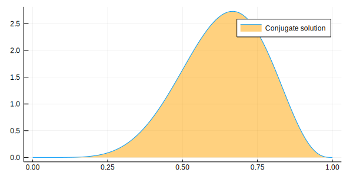

Load Julia packages (libraries) needed


```julia
using StatisticalRethinking
using Optim, Turing, Flux.Tracker
gr(size=(600,300));
```

    loaded


```julia
Turing.setadbackend(:reverse_diff);
Turing.turnprogress(false)
```

    ┌ Info: [Turing]: global PROGRESS is set as false
    └ @ Turing /Users/rob/.julia/packages/Turing/0dgDY/src/Turing.jl:81


    false


### snippet 2.8t

Define the data


```julia
k = 6; n = 9;
```

Define the model


```julia
@model globe_toss(n, k) = begin
  theta ~ Beta(1, 1) # prior
  k ~ Binomial(n, theta) # model
  return k, theta
end;
```

Compute the "maximum_a_posteriori" value

Set search bounds


```julia
lb = [0.0]; ub = [1.0];
```

Create (compile) the model


```julia
model = globe_toss(n, k);
```

Compute the maximum_a_posteriori


```julia
result = maximum_a_posteriori(model, lb, ub)
```


    Results of Optimization Algorithm
     * Algorithm: Fminbox with L-BFGS
     * Starting Point: [0.5278344803167265]
     * Minimizer: [0.6666666666021692]
     * Minimum: 1.297811e+00
     * Iterations: 3
     * Convergence: true
       * |x - x'| ≤ 0.0e+00: false 
         |x - x'| = 4.62e-08 
       * |f(x) - f(x')| ≤ 0.0e+00 |f(x)|: false
         |f(x) - f(x')| = 3.35e-14 |f(x)|
       * |g(x)| ≤ 1.0e-08: true 
         |g(x)| = 1.87e-09 
       * Stopped by an increasing objective: false
       * Reached Maximum Number of Iterations: false
     * Objective Calls: 43
     * Gradient Calls: 43


Use Turing mcmc


```julia
chn = sample(model, NUTS(2000, 200, 0.65));
```

    ┌ Info: [Turing] looking for good initial eps...
    └ @ Turing /Users/rob/.julia/packages/Turing/0dgDY/src/samplers/support/hmc_core.jl:246
    [NUTS{Turing.FluxTrackerAD,Union{}}] found initial ϵ: 0.4
    └ @ Turing /Users/rob/.julia/packages/Turing/0dgDY/src/samplers/support/hmc_core.jl:291
    ┌ Info:  Adapted ϵ = 1.0169708384755447, std = [1.0]; 200 iterations is used for adaption.
    └ @ Turing /Users/rob/.julia/packages/Turing/0dgDY/src/samplers/adapt/adapt.jl:91


    [NUTS] Finished with
      Running time        = 4.928556796000006;
      #lf / sample        = 0.002;
      #evals / sample     = 6.539;
      pre-cond. metric    = [1.0].


Look at the generated draws (in chn)


```julia
describe(chn)
```

    Iterations = 1:2000
    Thinning interval = 1
    Chains = 1
    Samples per chain = 2000
    
    Empirical Posterior Estimates:
                  Mean          SD       Naive SE       MCSE        ESS   
      lf_num  0.0020000000 0.089442719 0.0020000000 0.0020000000 2000.0000
     elapsed  0.0024642784 0.075235635 0.0016823199 0.0021980359 1171.5953
     epsilon  1.0548866415 0.461890119 0.0103281770 0.0271973584  288.4190
       theta  0.6320118370 0.139384359 0.0031167290 0.0049144284  804.4185
          lp -3.3031059558 0.785831841 0.0175717342 0.0220789561 1266.7828
    eval_num  6.5390000000 3.424812940 0.0765811454 0.1028281653 1109.3013
      lf_eps  1.0548866415 0.461890119 0.0103281770 0.0271973584  288.4190
    
    Quantiles:
                  2.5%         25.0%         50.0%         75.0%         97.5%    
      lf_num  0.0000000000  0.0000000000  0.0000000000  0.000000000  0.00000000000
     elapsed  0.0001347157  0.0001382845  0.0001499945  0.000359588  0.00055348215
     epsilon  0.5855121691  1.0169708385  1.0169708385  1.016970838  1.76718835045
       theta  0.3244780718  0.5476709438  0.6403916720  0.734694037  0.87726562376
          lp -5.5307004970 -3.4356358751 -2.9975359347 -2.822909944 -2.77975955697
    eval_num  4.0000000000  4.0000000000  4.0000000000 10.000000000 10.00000000000
      lf_eps  0.5855121691  1.0169708385  1.0169708385  1.016970838  1.76718835045
    


Look at the mean and sd


```julia
println("\ntheta = $(mean_and_std(chn[:theta][201:2000]))\n")
```

    
    theta = (0.6339059485766951, 0.13765016043159534)
    


Fix the inclusion of adaptation samples


```julia
chn2 = MCMCChain.Chains(chn.value[201:2000,:,:], names=chn.names)
```


    Object of type "Chains{Float64}"
    
    Iterations = 1:1800
    Thinning interval = 1
    Chains = 1
    Samples per chain = 1800
    
    Union{Missing, Float64}[0.0 0.0245762 … 22.0 1.01697; 0.0 0.000412524 … 4.0 1.01697; … ; 0.0 0.000145242 … 4.0 1.01697; 0.0 0.000145184 … 4.0 1.01697]


Look at the proper draws (in corrected chn2)


```julia
describe(chn2)
```

    Iterations = 1:1800
    Thinning interval = 1
    Chains = 1
    Samples per chain = 1800
    
    Empirical Posterior Estimates:
                  Mean                  SD                     Naive SE               MCSE         ESS   
      lf_num  0.00000000000 0.00000000000000000000000 0.000000000000000000000000 0.000000000000       NaN
     elapsed  0.00026535625 0.00064334605836867853230 0.000015163812017404300952 0.000019084184 1136.4284
     epsilon  1.01697083848 0.00000000000000066631893 0.000000000000000015705288 0.000000000000 1800.0000
       theta  0.63390594858 0.13765016043159533642992 0.003244445395753241690590 0.005260408830  684.7223
          lp -3.29160972548 0.75270133426860552638971 0.017741340588983106618670 0.020840661177 1304.4348
    eval_num  6.41666666667 2.96388302012344873048733 0.069859392739098497004946 0.059765336315 1800.0000
      lf_eps  1.01697083848 0.00000000000000066631893 0.000000000000000015705288 0.000000000000 1800.0000
    
    Quantiles:
                  2.5%           25.0%        50.0%         75.0%          97.5%    
      lf_num  0.00000000000  0.00000000000  0.00000000  0.00000000000  0.00000000000
     elapsed  0.00013467397  0.00013860325  0.00014983  0.00035968725  0.00048772625
     epsilon  1.01697083848  1.01697083848  1.01697084  1.01697083848  1.01697083848
       theta  0.33090315595  0.54872730536  0.64026470  0.73821364480  0.87726562376
          lp -5.50759395812 -3.43606207112 -3.00188591 -2.82229156435 -2.77975601301
    eval_num  4.00000000000  4.00000000000  4.00000000 10.00000000000 10.00000000000
      lf_eps  1.01697083848  1.01697083848  1.01697084  1.01697083848  1.01697083848
    


Compute at hpd region


```julia
bnds = MCMCChain.hpd(chn2[:, 4, :], alpha=0.06);
```

analytical calculation


```julia
w = 6; n = 9; x = 0:0.01:1
plot( x, pdf.(Beta( w+1 , n-w+1 ) , x ), fill=(0, .5,:orange), lab="Conjugate solution")
```





quadratic approximation


```julia
plot!( x, pdf.(Normal( 0.67 , 0.16 ) , x ), lab="Normal approximation")
```


Turing Chain &  89%hpd region boundaries


```julia
density!(chn2[:theta], lab="Turing chain")
vline!([bnds[1]], line=:dash, lab="hpd lower bound")
vline!([bnds[2]], line=:dash, lab="hpd upper bound")
```


    MethodError: no method matching getindex(::Chains{Float64}, ::Symbol)
    Closest candidates are:
      getindex(::Chains, ::Any, !Matched::Any, !Matched::Any) at /Users/rob/.julia/packages/MCMCChain/wl69W/src/chains.jl:110
      getindex(::Any, !Matched::AbstractTrees.ImplicitRootState) at /Users/rob/.julia/packages/AbstractTrees/z1wBY/src/AbstractTrees.jl:344

    

    Stacktrace:

     [1] top-level scope at In[16]:1


Show hpd region


```julia
println("hpd bounds = $bnds\n")
```

    hpd bounds =       94% Lower 94% Upper
    theta 0.3873379 0.9004367
    
    
    


End of `clip_08t.jl`

*This notebook was generated using [Literate.jl](https://github.com/fredrikekre/Literate.jl).*
