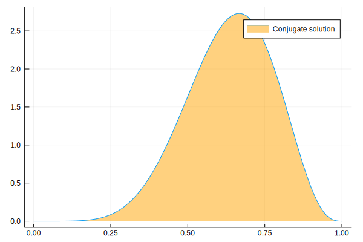
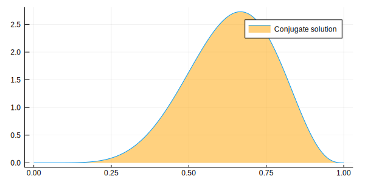
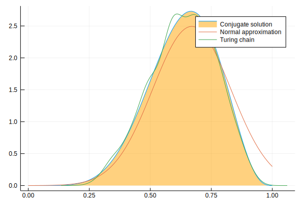

Load Julia packages (libraries) needed


```julia
using StatisticalRethinking
using StatsFuns, Optim, Turing, Flux.Tracker

Turing.setadbackend(:reverse_diff)
```


    :reverse_diff


### snippet 2.8t

Define the data


```julia
k = 6; n = 9;
```

Define the model


```julia
@model globe_toss(n, k) = begin
  theta ~ Beta(1, 1) # prior
  k ~ Binomial(n, theta) # model
  return k, theta
end;
```

Compute the "maximum_a_posteriori" value

Set search bounds


```julia
lb = [0.0]; ub = [1.0];
```

Create (compile) the model


```julia
model = globe_toss(n, k);
```

Compute the maximum_a_posteriori


```julia
result = maximum_a_posteriori(model, lb, ub)
```


    Results of Optimization Algorithm
     * Algorithm: Fminbox with L-BFGS
     * Starting Point: [0.4025469894808926]
     * Minimizer: [0.6666666665600872]
     * Minimum: 1.297811e+00
     * Iterations: 3
     * Convergence: true
       * |x - x'| ≤ 0.0e+00: false 
         |x - x'| = 8.80e-08 
       * |f(x) - f(x')| ≤ 0.0e+00 |f(x)|: false
         |f(x) - f(x')| = 1.21e-13 |f(x)|
       * |g(x)| ≤ 1.0e-08: true 
         |g(x)| = 3.57e-09 
       * Stopped by an increasing objective: false
       * Reached Maximum Number of Iterations: false
     * Objective Calls: 52
     * Gradient Calls: 52


Use Turing mcmc


```julia
chn = sample(model, NUTS(1000, 0.65));
```

    ┌ Info: [Turing] looking for good initial eps...
    └ @ Turing /Users/rob/.julia/packages/Turing/pRhjG/src/samplers/support/hmc_core.jl:246
    [NUTS{Any}] found initial ϵ: 1.6
    └ @ Turing /Users/rob/.julia/packages/Turing/pRhjG/src/samplers/support/hmc_core.jl:291
    ┌ Warning: Numerical error has been found in gradients.
    └ @ Turing /Users/rob/.julia/packages/Turing/pRhjG/src/core/ad.jl:114
    ┌ Warning: grad = [NaN]
    └ @ Turing /Users/rob/.julia/packages/Turing/pRhjG/src/core/ad.jl:115
    ┌ Info:  Adapted ϵ = 0.9229926068166693, std = [1.0]; 500 iterations is used for adaption.
    └ @ Turing /Users/rob/.julia/packages/Turing/pRhjG/src/samplers/adapt/adapt.jl:91


    [NUTS] Finished with
      Running time        = 0.36302001400000006;
      #lf / sample        = 0.006;
      #evals / sample     = 7.195;
      pre-cond. metric    = [1.0].


Look at the generated draws (in chn)


```julia
describe(chn[:theta])
```

    Summary Stats:
    Mean:           0.632864
    Minimum:        0.116554
    1st Quartile:   0.549645
    Median:         0.641930
    3rd Quartile:   0.726905
    Maximum:        0.958864
    Length:         1000
    Type:           Float64


Compute at hpd region


```julia
bnds = MCMCChain.hpd(chn[:theta], alpha=0.05);
```

analytical calculation


```julia
w = 6
n = 9
x = 0:0.01:1
plot( x, pdf.(Beta( w+1 , n-w+1 ) , x ), fill=(0, .5,:orange), lab="Conjugate solution")
```





quadratic approximation


```julia
plot!( x, pdf.(Normal( 0.67 , 0.16 ) , x ), lab="Normal approximation")
```





Turing Chain &  89%hpd region boundaries


```julia
density!(chn[:theta], lab="Turing chain")
vline!([bnds[1]], line=:dash, lab="hpd lower bound")
vline!([bnds[2]], line=:dash, lab="hpd upper bound")
```





Show hpd region


```julia
println("hpd bounds = $bnds\n")
```

    hpd bounds = [0.388854, 0.856032]
    


*This notebook was generated using [Literate.jl](https://github.com/fredrikekre/Literate.jl).*
