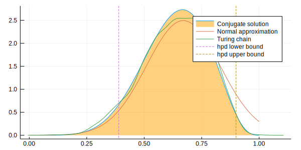

Load Julia packages (libraries) needed


```julia
using StatisticalRethinking
using StatsFuns, Optim, Turing, Flux.Tracker
gr(size=(600,300));

Turing.setadbackend(:reverse_diff)
```

    loaded


    ┌ Warning: Package Turing does not have CmdStan in its dependencies:
    │ - If you have Turing checked out for development and have
    │   added CmdStan as a dependency but haven't updated your primary
    │   environment's manifest file, try `Pkg.resolve()`.
    │ - Otherwise you may need to report an issue with Turing
    │ Loading CmdStan into Turing from project dependency, future warnings for Turing are suppressed.
    └ @ nothing nothing:840
    WARNING: using CmdStan.Sample in module Turing conflicts with an existing identifier.


    :reverse_diff


### snippet 2.8t

Define the data


```julia
k = 6; n = 9;
```

Define the model


```julia
@model globe_toss(n, k) = begin
  theta ~ Beta(1, 1) # prior
  k ~ Binomial(n, theta) # model
  return k, theta
end;
```

Compute the "maximum_a_posteriori" value

Set search bounds


```julia
lb = [0.0]; ub = [1.0];
```

Create (compile) the model


```julia
model = globe_toss(n, k);
```

Compute the maximum_a_posteriori


```julia
result = maximum_a_posteriori(model, lb, ub)
```


    Results of Optimization Algorithm
     * Algorithm: Fminbox with L-BFGS
     * Starting Point: [0.7434783876300437]
     * Minimizer: [0.66666666662285]
     * Minimum: 1.297811e+00
     * Iterations: 3
     * Convergence: true
       * |x - x'| ≤ 0.0e+00: false 
         |x - x'| = 2.56e-08 
       * |f(x) - f(x')| ≤ 0.0e+00 |f(x)|: false
         |f(x) - f(x')| = 1.03e-14 |f(x)|
       * |g(x)| ≤ 1.0e-08: true 
         |g(x)| = 1.03e-09 
       * Stopped by an increasing objective: false
       * Reached Maximum Number of Iterations: false
     * Objective Calls: 46
     * Gradient Calls: 46


Use Turing mcmc


```julia
Turing.turnprogress(false)
chn = sample(model, NUTS(2000, 1000, 0.65));
```

    ┌ Info: [Turing]: global PROGRESS is set as false
    └ @ Turing /Users/rob/.julia/packages/Turing/xp88X/src/Turing.jl:81
    ┌ Info: [Turing] looking for good initial eps...
    └ @ Turing /Users/rob/.julia/packages/Turing/xp88X/src/samplers/support/hmc_core.jl:246
    [NUTS{Turing.FluxTrackerAD,Union{}}] found initial ϵ: 1.6
    └ @ Turing /Users/rob/.julia/packages/Turing/xp88X/src/samplers/support/hmc_core.jl:291
    ┌ Warning: Numerical error has been found in gradients.
    └ @ Turing /Users/rob/.julia/packages/Turing/xp88X/src/core/ad.jl:154
    ┌ Warning: grad = [NaN]
    └ @ Turing /Users/rob/.julia/packages/Turing/xp88X/src/core/ad.jl:155
    ┌ Info:  Adapted ϵ = 0.8813360600868692, std = [1.0]; 1000 iterations is used for adaption.
    └ @ Turing /Users/rob/.julia/packages/Turing/xp88X/src/samplers/adapt/adapt.jl:91


    [NUTS] Finished with
      Running time        = 7.983057395;
      #lf / sample        = 0.003;
      #evals / sample     = 7.1935;
      pre-cond. metric    = [1.0].


Look at the generated draws (in chn)


```julia
describe(chn)
```

    Iterations = 1:2000
    Thinning interval = 1
    Chains = 1
    Samples per chain = 2000
    
    Empirical Posterior Estimates:
                 Mean         SD       Naive SE       MCSE         ESS   
      lf_num  0.003000000 0.13416408 0.0030000000 0.0030000000 2000.00000
     elapsed  0.003991529 0.12238218 0.0027365488 0.0034807975 1236.17191
     epsilon  1.050938864 0.73716204 0.0164834444 0.0425976965  299.47026
       theta  0.632865211 0.13667539 0.0030561547 0.0046385255  868.20199
          lp -3.281397546 0.68796522 0.0153833700 0.0244474040  791.89475
    eval_num  7.193500000 4.21366055 0.0942203142 0.1510215652  778.46870
      lf_eps  1.050938864 0.73716204 0.0164834444 0.0425976965  299.47026
    
    Quantiles:
                  2.5%          25.0%         50.0%        75.0%         97.5%    
      lf_num  0.00000000000  0.0000000000  0.000000000  0.0000000000  0.0000000000
     elapsed  0.00016189595  0.0002256595  0.000379562  0.0007251345  0.0012314391
     epsilon  0.37115625009  0.8813360601  0.881336060  1.0154807930  2.5551687076
       theta  0.36302409660  0.5337383654  0.637607757  0.7378252078  0.8783054403
          lp -5.21044285352 -3.4216496169 -3.038448885 -2.8403303752 -2.7799811202
    eval_num  4.00000000000  4.0000000000  4.000000000 10.0000000000 16.0000000000
      lf_eps  0.37115625009  0.8813360601  0.881336060  1.0154807930  2.5551687076
    


Look at the mean and sd


```julia
println("\ntheta = $(mean_and_std(chn[:theta][1001:2000]))\n")
```

    
    theta = (0.6340109002953115, 0.14368913428146277)
    


Compute at hpd region


```julia
bnds = MCMCChain.hpd(chn[:theta], alpha=0.06);
```

analytical calculation


```julia
w = 6; n = 9; x = 0:0.01:1
plot( x, pdf.(Beta( w+1 , n-w+1 ) , x ), fill=(0, .5,:orange), lab="Conjugate solution")
```


quadratic approximation


```julia
plot!( x, pdf.(Normal( 0.67 , 0.16 ) , x ), lab="Normal approximation")
```


Turing Chain &  89%hpd region boundaries


```julia
density!(chn[:theta], lab="Turing chain")
vline!([bnds[1]], line=:dash, lab="hpd lower bound")
vline!([bnds[2]], line=:dash, lab="hpd upper bound")
```





Show hpd region


```julia
println("hpd bounds = $bnds\n")
```

    hpd bounds = [0.399787, 0.893698]
    


End of `clip_08t.jl`

*This notebook was generated using [Literate.jl](https://github.com/fredrikekre/Literate.jl).*
