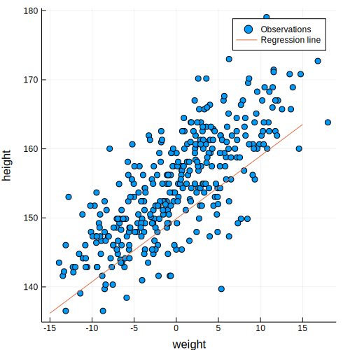

```julia
using StatisticalRethinking
gr(size=(500,500));

Turing.setadbackend(:reverse_diff)

ProjDir = rel_path("..", "chapters", "04")
cd(ProjDir)
```

### snippet 4.43


```julia
howell1 = CSV.read(rel_path("..", "data", "Howell1.csv"), delim=';')
df = convert(DataFrame, howell1);
```

Use only adults


```julia
df2 = filter(row -> row[:age] >= 18, df);
```

Center the weight observations and add a column to df2


```julia
mean_weight = mean(df2[:weight])
df2 = hcat(df2, df2[:weight] .- mean_weight)
rename!(df2, :x1 => :weight_c) # Rename our col x1 => log_gdp
```


<table class="data-frame"><thead><tr><th></th><th>height</th><th>weight</th><th>age</th><th>male</th><th>weight_c</th></tr><tr><th></th><th>Float64⍰</th><th>Float64⍰</th><th>Float64⍰</th><th>Int64⍰</th><th>Float64</th></tr></thead><tbody><p>352 rows × 5 columns</p><tr><th>1</th><td>151.765</td><td>47.8256</td><td>63.0</td><td>1</td><td>2.83512</td></tr><tr><th>2</th><td>139.7</td><td>36.4858</td><td>63.0</td><td>0</td><td>-8.50468</td></tr><tr><th>3</th><td>136.525</td><td>31.8648</td><td>65.0</td><td>0</td><td>-13.1256</td></tr><tr><th>4</th><td>156.845</td><td>53.0419</td><td>41.0</td><td>1</td><td>8.05143</td></tr><tr><th>5</th><td>145.415</td><td>41.2769</td><td>51.0</td><td>0</td><td>-3.71361</td></tr><tr><th>6</th><td>163.83</td><td>62.9926</td><td>35.0</td><td>1</td><td>18.0021</td></tr><tr><th>7</th><td>149.225</td><td>38.2435</td><td>32.0</td><td>0</td><td>-6.74701</td></tr><tr><th>8</th><td>168.91</td><td>55.48</td><td>27.0</td><td>1</td><td>10.4895</td></tr><tr><th>9</th><td>147.955</td><td>34.8699</td><td>19.0</td><td>0</td><td>-10.1206</td></tr><tr><th>10</th><td>165.1</td><td>54.4877</td><td>54.0</td><td>1</td><td>9.49725</td></tr><tr><th>11</th><td>154.305</td><td>49.8951</td><td>47.0</td><td>0</td><td>4.90463</td></tr><tr><th>12</th><td>151.13</td><td>41.2202</td><td>66.0</td><td>1</td><td>-3.77031</td></tr><tr><th>13</th><td>144.78</td><td>36.0322</td><td>73.0</td><td>0</td><td>-8.95827</td></tr><tr><th>14</th><td>149.9</td><td>47.7</td><td>20.0</td><td>0</td><td>2.70951</td></tr><tr><th>15</th><td>150.495</td><td>33.8493</td><td>65.3</td><td>0</td><td>-11.1412</td></tr><tr><th>16</th><td>163.195</td><td>48.5627</td><td>36.0</td><td>1</td><td>3.57221</td></tr><tr><th>17</th><td>157.48</td><td>42.3258</td><td>44.0</td><td>1</td><td>-2.66468</td></tr><tr><th>18</th><td>143.942</td><td>38.3569</td><td>31.0</td><td>0</td><td>-6.63361</td></tr><tr><th>19</th><td>161.29</td><td>48.9879</td><td>39.0</td><td>1</td><td>3.99745</td></tr><tr><th>20</th><td>156.21</td><td>42.7227</td><td>29.0</td><td>0</td><td>-2.26779</td></tr><tr><th>21</th><td>146.4</td><td>35.4936</td><td>56.0</td><td>1</td><td>-9.49691</td></tr><tr><th>22</th><td>148.59</td><td>37.9033</td><td>45.0</td><td>0</td><td>-7.0872</td></tr><tr><th>23</th><td>147.32</td><td>35.4652</td><td>19.0</td><td>0</td><td>-9.52526</td></tr><tr><th>24</th><td>147.955</td><td>40.313</td><td>29.0</td><td>1</td><td>-4.6775</td></tr><tr><th>25</th><td>161.925</td><td>55.1114</td><td>30.0</td><td>1</td><td>10.1209</td></tr><tr><th>26</th><td>146.05</td><td>37.5064</td><td>24.0</td><td>0</td><td>-7.4841</td></tr><tr><th>27</th><td>146.05</td><td>38.4986</td><td>35.0</td><td>0</td><td>-6.49186</td></tr><tr><th>28</th><td>152.705</td><td>46.6066</td><td>33.0</td><td>0</td><td>1.61609</td></tr><tr><th>29</th><td>142.875</td><td>38.8388</td><td>27.0</td><td>0</td><td>-6.15167</td></tr><tr><th>30</th><td>142.875</td><td>35.5786</td><td>32.0</td><td>0</td><td>-9.41186</td></tr><tr><th>&vellip;</th><td>&vellip;</td><td>&vellip;</td><td>&vellip;</td><td>&vellip;</td><td>&vellip;</td></tr></tbody></table>


Extract variables for Turing model


```julia
y = convert(Vector{Float64}, df2[:height]);
x = convert(Vector{Float64}, df2[:weight_c]);
```

Define the regression model


```julia
@model line(y, x) = begin
    #priors
    alpha ~ Normal(178.0, 100.0)
    beta ~ Normal(0.0, 10.0)
    s ~ Uniform(0, 50)

    #model
    mu = alpha .+ beta*x
    for i in 1:length(y)
      y[i] ~ Normal(mu[i], s)
    end
end;
```

Draw the samples


```julia
chn = sample(line(y, x), Turing.NUTS(1000, 0.65));
```

    ┌ Info: [Turing] looking for good initial eps...
    └ @ Turing /Users/rob/.julia/packages/Turing/NuLQp/src/samplers/support/hmc_core.jl:246
    [NUTS{Turing.FluxTrackerAD,Any}] found initial ϵ: 0.1
    └ @ Turing /Users/rob/.julia/packages/Turing/NuLQp/src/samplers/support/hmc_core.jl:291
    [NUTS] Sampling...  1%  ETA: 0:02:17
      ϵ:         0.030621510185477197
      α:         0.971444984407535
    4m  pre_cond:  [1.0, 1.0, 1.0]
    
    
    [NUTS] Sampling...  2%  ETA: 0:01:48
      ϵ:         0.07507512342948845
      α:         0.8506390478602415
    4m  pre_cond:  [1.0, 1.0, 1.0]
    
    
    [NUTS] Sampling...  3%  ETA: 0:01:49
      ϵ:         0.07105035532718221
      α:         0.8526278877395898
    4m  pre_cond:  [1.0, 1.0, 1.0]
    
    
    [NUTS] Sampling...  5%  ETA: 0:01:33
      ϵ:         0.13900175864238534
      α:         0.0
    4m  pre_cond:  [1.0, 1.0, 1.0]
    
    
    [NUTS] Sampling...  6%  ETA: 0:01:24
      ϵ:         0.0377494605487467
      α:         0.979311853297689
    4m  pre_cond:  [1.0, 1.0, 1.0]
    
    
    [NUTS] Sampling...  7%  ETA: 0:01:35
      ϵ:         0.023265199751759863
      α:         0.9910477925426612
    4m  pre_cond:  [1.0, 1.0, 1.0]
    
    
    [NUTS] Sampling...  8%  ETA: 0:01:36
      ϵ:         0.044066192482624555
      α:         0.9167461521601791
    4m  pre_cond:  [1.0, 1.0, 1.0]
    
    
    [NUTS] Sampling...  9%  ETA: 0:01:28
      ϵ:         0.046423884666471085
      α:         0.9499033725758392
    4m  pre_cond:  [1.0, 1.0, 1.0]
    
    
    [NUTS] Sampling... 11%  ETA: 0:01:25
      ϵ:         0.012651481210700364
      α:         0.9959277768516535
    4m  pre_cond:  [1.0, 1.0, 1.0]
    
    
    [NUTS] Sampling... 12%  ETA: 0:01:22
      ϵ:         0.020784265796679614
      α:         0.9640121846625895
    4m  pre_cond:  [1.0, 1.0, 1.0]
    
    
    [NUTS] Sampling... 13%  ETA: 0:01:22
      ϵ:         0.05269271193032281
      α:         0.04073975398185035
    4m  pre_cond:  [1.0, 1.0, 1.0]
    
    
    [NUTS] Sampling... 13%  ETA: 0:01:29
      ϵ:         0.02696422577598999
      α:         0.7595735048433905
    4m  pre_cond:  [1.0, 1.0, 1.0]
    
    
    [NUTS] Sampling... 14%  ETA: 0:01:28
      ϵ:         0.040290135080635246
      α:         1.0
    4m  pre_cond:  [1.0, 1.0, 1.0]
    
    
    [NUTS] Sampling... 15%  ETA: 0:01:28
      ϵ:         0.046151408612101374
      α:         0.9586726675616376
    4m  pre_cond:  [1.0, 1.0, 1.0]
    
    
    [NUTS] Sampling... 16%  ETA: 0:01:28
      ϵ:         0.011592470318701673
      α:         0.9916146284312164
    4m  pre_cond:  [1.0, 1.0, 1.0]
    
    
    [NUTS] Sampling... 16%  ETA: 0:01:31
      ϵ:         0.03919444384515175
      α:         0.9820601247012629
    4m  pre_cond:  [1.0, 1.0, 1.0]
    
    
    [NUTS] Sampling... 17%  ETA: 0:01:31
      ϵ:         0.017745626671905285
      α:         0.9909261246495344
    4m  pre_cond:  [1.0, 1.0, 1.0]
    
    
    [NUTS] Sampling... 18%  ETA: 0:01:29
      ϵ:         0.04332538402166794
      α:         0.8616129141997695
    4m  pre_cond:  [1.0, 1.0, 1.0]
    
    
    [NUTS] Sampling... 20%  ETA: 0:01:26
      ϵ:         0.06983771821723087
      α:         0.7391970072449183
    4m  pre_cond:  [1.0, 1.0, 1.0]
    
    
    [NUTS] Sampling... 21%  ETA: 0:01:26
      ϵ:         0.024688560787451456
      α:         0.9569235352210996
    4m  pre_cond:  [1.0, 1.0, 1.0]
    
    
    [NUTS] Sampling... 22%  ETA: 0:01:23
      ϵ:         0.041421774593537686
      α:         0.8242205701882686
    4m  pre_cond:  [1.0, 1.0, 1.0]
    
    
    [NUTS] Sampling... 23%  ETA: 0:01:20
      ϵ:         0.02157530393433103
      α:         0.9879306032187101
    4m  pre_cond:  [1.0, 1.0, 1.0]
    
    
    [NUTS] Sampling... 24%  ETA: 0:01:20
      ϵ:         0.024346946791278457
      α:         0.9958831484578826
    4m  pre_cond:  [1.0, 1.0, 1.0]
    
    
    [NUTS] Sampling... 26%  ETA: 0:01:17
      ϵ:         0.013424715236216241
      α:         0.9960359539864607
    4m  pre_cond:  [1.0, 1.0, 1.0]
    
    
    [NUTS] Sampling... 27%  ETA: 0:01:16
      ϵ:         0.03553763681450339
      α:         0.5938404977946894
    4m  pre_cond:  [1.0, 1.0, 1.0]
    
    
    [NUTS] Sampling... 28%  ETA: 0:01:16
      ϵ:         0.05388172793426457
      α:         0.9932570205265401
    4m  pre_cond:  [1.0, 1.0, 1.0]
    
    
    [NUTS] Sampling... 28%  ETA: 0:01:15
      ϵ:         0.017030411091837873
      α:         0.9999777521357414
    4m  pre_cond:  [1.0, 1.0, 1.0]
    
    
    [NUTS] Sampling... 29%  ETA: 0:01:16
      ϵ:         0.037945627490201875
      α:         0.9438833910755161
    4m  pre_cond:  [1.0, 1.0, 1.0]
    
    
    [NUTS] Sampling... 31%  ETA: 0:01:14
      ϵ:         0.020962023363864456
      α:         0.9994999273832851
    4m  pre_cond:  [1.0, 1.0, 1.0]
    
    
    [NUTS] Sampling... 32%  ETA: 0:01:13
      ϵ:         0.04832212464718313
      α:         0.9827612257362954
    4m  pre_cond:  [1.0, 1.0, 1.0]
    
    
    [NUTS] Sampling... 32%  ETA: 0:01:13
      ϵ:         0.029635456401915127
      α:         0.9851330041157187
    4m  pre_cond:  [1.0, 1.0, 1.0]
    
    
    [NUTS] Sampling... 33%  ETA: 0:01:12
      ϵ:         0.0486494676278722
      α:         1.0
    4m  pre_cond:  [1.0, 1.0, 1.0]
    
    
    [NUTS] Sampling... 34%  ETA: 0:01:12
      ϵ:         0.044522973764223484
      α:         0.7901212313870927
    4m  pre_cond:  [1.0, 1.0, 1.0]
    
    
    [NUTS] Sampling... 35%  ETA: 0:01:12
      ϵ:         0.026357430321186617
      α:         0.9350483206417142
    4m  pre_cond:  [1.0, 1.0, 1.0]
    
    
    [NUTS] Sampling... 36%  ETA: 0:01:10
      ϵ:         0.04017976703918842
      α:         1.0
    4m  pre_cond:  [1.0, 1.0, 1.0]
    
    
    [NUTS] Sampling... 37%  ETA: 0:01:08
      ϵ:         0.06549627475992438
      α:         0.9205365666114068
    4m  pre_cond:  [1.0, 1.0, 1.0]
    
    
    [NUTS] Sampling... 39%  ETA: 0:01:04
      ϵ:         0.07567387645944662
      α:         0.004903396357017697
    4m  pre_cond:  [1.0, 1.0, 1.0]
    
    
    [NUTS] Sampling... 40%  ETA: 0:01:03
      ϵ:         0.028262060602874974
      α:         0.9977256401201093
    4m  pre_cond:  [1.0, 1.0, 1.0]
    
    
    [NUTS] Sampling... 41%  ETA: 0:01:03
      ϵ:         0.06287459126643972
      α:         0.9452952555959094
    4m  pre_cond:  [1.0, 1.0, 1.0]
    
    
    [NUTS] Sampling... 42%  ETA: 0:01:01
      ϵ:         0.039012713569088524
      α:         0.993759805492366
    4m  pre_cond:  [1.0, 1.0, 1.0]
    
    
    [NUTS] Sampling... 43%  ETA: 0:01:00
      ϵ:         0.05563479373348331
      α:         1.0
    4m  pre_cond:  [1.0, 1.0, 1.0]
    
    
    [NUTS] Sampling... 44%  ETA: 0:00:59
      ϵ:         0.037485722639272315
      α:         0.9790685519227644
    4m  pre_cond:  [1.0, 1.0, 1.0]
    
    
    [NUTS] Sampling... 45%  ETA: 0:00:58
      ϵ:         0.030471451448143647
      α:         0.9406330655558192
    4m  pre_cond:  [1.0, 1.0, 1.0]
    
    
    [NUTS] Sampling... 46%  ETA: 0:00:57
      ϵ:         0.015277651551107736
      α:         0.9997549844138481
    4m  pre_cond:  [1.0, 1.0, 1.0]
    
    
    [NUTS] Sampling... 48%  ETA: 0:00:56
      ϵ:         0.06367749984198584
      α:         0.005577630308294407
    4m  pre_cond:  [1.0, 1.0, 1.0]
    
    
    [NUTS] Sampling... 48%  ETA: 0:00:56
      ϵ:         0.07320558811452729
      α:         0.273211141388586
    4m  pre_cond:  [1.0, 1.0, 1.0]
    
    
    [NUTS] Sampling... 49%  ETA: 0:00:56
      ϵ:         0.06302253635924066
      α:         0.9029572349859492
    4m  pre_cond:  [1.0, 1.0, 1.0]
    
    
    [NUTS] Sampling... 50%  ETA: 0:00:55
      ϵ:         0.017489709739525426
      α:         0.9964921135465479
    ┌ Info:  Adapted ϵ = 0.05870745011128406, std = [1.0, 1.0, 1.0]; 500 iterations is used for adaption.
    └ @ Turing /Users/rob/.julia/packages/Turing/NuLQp/src/samplers/adapt/adapt.jl:91
    
    
    
    [NUTS] Sampling... 51%  ETA: 0:00:53
      ϵ:         0.05870745011128406
      α:         0.9367030050256292
    4m  pre_cond:  [1.0, 1.0, 1.0]
    
    
    [NUTS] Sampling... 53%  ETA: 0:00:50
      ϵ:         0.05870745011128406
      α:         0.9877058362545301
    4m  pre_cond:  [1.0, 1.0, 1.0]
    
    
    [NUTS] Sampling... 54%  ETA: 0:00:48
      ϵ:         0.05870745011128406
      α:         0.7598424344290833
    4m  pre_cond:  [1.0, 1.0, 1.0]
    
    
    [NUTS] Sampling... 56%  ETA: 0:00:46
      ϵ:         0.05870745011128406
      α:         0.9870281485076235
    4m  pre_cond:  [1.0, 1.0, 1.0]
    
    
    [NUTS] Sampling... 57%  ETA: 0:00:44
      ϵ:         0.05870745011128406
      α:         0.3142489682488212
    4m  pre_cond:  [1.0, 1.0, 1.0]
    
    
    [NUTS] Sampling... 59%  ETA: 0:00:42
      ϵ:         0.05870745011128406
      α:         0.9257878951107651
    4m  pre_cond:  [1.0, 1.0, 1.0]
    
    
    [NUTS] Sampling... 60%  ETA: 0:00:41
      ϵ:         0.05870745011128406
      α:         0.9123389386730564
    4m  pre_cond:  [1.0, 1.0, 1.0]
    
    
    [NUTS] Sampling... 61%  ETA: 0:00:40
      ϵ:         0.05870745011128406
      α:         0.8244356069329262
    4m  pre_cond:  [1.0, 1.0, 1.0]
    
    
    [NUTS] Sampling... 63%  ETA: 0:00:37
      ϵ:         0.05870745011128406
      α:         0.8708223463208419
    4m  pre_cond:  [1.0, 1.0, 1.0]
    
    
    [NUTS] Sampling... 64%  ETA: 0:00:36
      ϵ:         0.05870745011128406
      α:         0.33763966916840177
    4m  pre_cond:  [1.0, 1.0, 1.0]
    
    
    [NUTS] Sampling... 66%  ETA: 0:00:34
      ϵ:         0.05870745011128406
      α:         0.711791929474511
    4m  pre_cond:  [1.0, 1.0, 1.0]
    
    
    [NUTS] Sampling... 67%  ETA: 0:00:33
      ϵ:         0.05870745011128406
      α:         0.8657283901435409
    4m  pre_cond:  [1.0, 1.0, 1.0]
    
    
    [NUTS] Sampling... 68%  ETA: 0:00:31
      ϵ:         0.05870745011128406
      α:         0.8540907306465231
    4m  pre_cond:  [1.0, 1.0, 1.0]
    
    
    [NUTS] Sampling... 69%  ETA: 0:00:30
      ϵ:         0.05870745011128406
      α:         0.9990222886901134
    4m  pre_cond:  [1.0, 1.0, 1.0]
    
    
    [NUTS] Sampling... 71%  ETA: 0:00:29
      ϵ:         0.05870745011128406
      α:         0.9740251109387845
    4m  pre_cond:  [1.0, 1.0, 1.0]
    
    
    [NUTS] Sampling... 72%  ETA: 0:00:27
      ϵ:         0.05870745011128406
      α:         0.9655579805151336
    4m  pre_cond:  [1.0, 1.0, 1.0]
    
    
    [NUTS] Sampling... 73%  ETA: 0:00:26
      ϵ:         0.05870745011128406
      α:         0.9240218035037518
    4m  pre_cond:  [1.0, 1.0, 1.0]
    
    
    [NUTS] Sampling... 74%  ETA: 0:00:26
      ϵ:         0.05870745011128406
      α:         0.9668631444697149
    4m  pre_cond:  [1.0, 1.0, 1.0]
    
    
    [NUTS] Sampling... 75%  ETA: 0:00:24
      ϵ:         0.05870745011128406
      α:         0.8503728212894988
    4m  pre_cond:  [1.0, 1.0, 1.0]
    
    
    [NUTS] Sampling... 76%  ETA: 0:00:23
      ϵ:         0.05870745011128406
      α:         0.9730035497316446
    4m  pre_cond:  [1.0, 1.0, 1.0]
    
    
    [NUTS] Sampling... 78%  ETA: 0:00:22
      ϵ:         0.05870745011128406
      α:         0.9864977712189693
    4m  pre_cond:  [1.0, 1.0, 1.0]
    
    
    [NUTS] Sampling... 79%  ETA: 0:00:20
      ϵ:         0.05870745011128406
      α:         0.9687819504479562
    4m  pre_cond:  [1.0, 1.0, 1.0]
    
    
    [NUTS] Sampling... 80%  ETA: 0:00:20
      ϵ:         0.05870745011128406
      α:         0.7638507638033203
    4m  pre_cond:  [1.0, 1.0, 1.0]
    
    
    [NUTS] Sampling... 81%  ETA: 0:00:19
      ϵ:         0.05870745011128406
      α:         0.813037319611285
    4m  pre_cond:  [1.0, 1.0, 1.0]
    
    
    [NUTS] Sampling... 83%  ETA: 0:00:17
      ϵ:         0.05870745011128406
      α:         1.0
    4m  pre_cond:  [1.0, 1.0, 1.0]
    
    
    [NUTS] Sampling... 84%  ETA: 0:00:16
      ϵ:         0.05870745011128406
      α:         0.12832554514648725
    4m  pre_cond:  [1.0, 1.0, 1.0]
    
    
    [NUTS] Sampling... 85%  ETA: 0:00:15
      ϵ:         0.05870745011128406
      α:         0.9581036180166032
    4m  pre_cond:  [1.0, 1.0, 1.0]
    
    
    [NUTS] Sampling... 86%  ETA: 0:00:14
      ϵ:         0.05870745011128406
      α:         0.8662600140260079
    4m  pre_cond:  [1.0, 1.0, 1.0]
    
    
    [NUTS] Sampling... 87%  ETA: 0:00:13
      ϵ:         0.05870745011128406
      α:         0.9129535994621265
    4m  pre_cond:  [1.0, 1.0, 1.0]
    
    
    [NUTS] Sampling... 89%  ETA: 0:00:11
      ϵ:         0.05870745011128406
      α:         0.3987149377851587
    4m  pre_cond:  [1.0, 1.0, 1.0]
    
    
    [NUTS] Sampling... 90%  ETA: 0:00:09
      ϵ:         0.05870745011128406
      α:         0.9724466644506152
    4m  pre_cond:  [1.0, 1.0, 1.0]
    
    
    [NUTS] Sampling... 91%  ETA: 0:00:09
      ϵ:         0.05870745011128406
      α:         0.9194340800773689
    4m  pre_cond:  [1.0, 1.0, 1.0]
    
    
    [NUTS] Sampling... 92%  ETA: 0:00:07
      ϵ:         0.05870745011128406
      α:         0.579069900415784
    4m  pre_cond:  [1.0, 1.0, 1.0]
    
    
    [NUTS] Sampling... 94%  ETA: 0:00:06
      ϵ:         0.05870745011128406
      α:         0.9543486769649749
    4m  pre_cond:  [1.0, 1.0, 1.0]
    
    
    [NUTS] Sampling... 95%  ETA: 0:00:05
      ϵ:         0.05870745011128406
      α:         0.9756282352944297
    4m  pre_cond:  [1.0, 1.0, 1.0]
    
    
    [NUTS] Sampling... 97%  ETA: 0:00:03
      ϵ:         0.05870745011128406
      α:         0.6729088269064374
    4m  pre_cond:  [1.0, 1.0, 1.0]
    
    
    [NUTS] Sampling... 98%  ETA: 0:00:02
      ϵ:         0.05870745011128406
      α:         0.8827893208856435
    4m  pre_cond:  [1.0, 1.0, 1.0]
    
    


    [NUTS] Finished with
      Running time        = 93.74648591900004;
      #lf / sample        = 0.002;
      #evals / sample     = 20.272;
      pre-cond. metric    = [1.0, 1.0, 1.0].


    [NUTS] Sampling...100% Time: 0:01:34


Describe the chain result


```julia
describe(chn)
```

    Iterations = 1:1000
    Thinning interval = 1
    Chains = 1
    Samples per chain = 1000
    
    Empirical Posterior Estimates:
                  Mean            SD        Naive SE        MCSE         ESS    
       alpha   153.14719937  10.810424888 0.3418556512  1.4582064846   54.960095
        beta     0.90585034   0.079704618 0.0025204813  0.0016389693 1000.000000
      lf_num     0.00200000   0.063245553 0.0020000000  0.0020000000 1000.000000
           s     6.00564996   5.329796821 0.1685429742  0.8996190097   35.099753
     elapsed     0.09374649   0.099242518 0.0031383240  0.0055587373  318.744897
     epsilon     0.07237568   0.136671220 0.0043219234  0.0087528107  243.814242
          lp -1112.05625117 171.984325602 5.4386219075 28.3846353549   36.712258
    eval_num    20.27200000  20.520309430 0.6489091609  1.1679058181  308.711044
      lf_eps     0.07237568   0.136671220 0.0043219234  0.0087528107  243.814242
    
    Quantiles:
                   2.5%           25.0%          50.0%          75.0%          97.5%    
       alpha   143.004513218   154.36820359   154.60168545   154.78581833   155.13813858
        beta     0.805370573     0.87419404     0.90723197     0.93767440     1.00534985
      lf_num     0.000000000     0.00000000     0.00000000     0.00000000     0.00000000
           s     4.741723190     4.98449843     5.11592868     5.27031929    12.88314522
     elapsed     0.011128187     0.04187139     0.04707028     0.12095932     0.34780019
     epsilon     0.017660848     0.05603582     0.05870745     0.05870745     0.16803537
          lp -1404.543142287 -1084.55526107 -1083.44758964 -1082.86568600 -1082.32520095
    eval_num     4.000000000    10.00000000    10.00000000    22.00000000    70.00000000
      lf_eps     0.017660848     0.05603582     0.05870745     0.05870745     0.16803537
    


Compare with a previous result


```julia
clip_43s_example_output = "

Iterations = 1:1000
Thinning interval = 1
Chains = 1,2,3,4
Samples per chain = 1000

Empirical Posterior Estimates:
         Mean        SD       Naive SE       MCSE      ESS
alpha 154.597086 0.27326431 0.0043206882 0.0036304132 1000
 beta   0.906380 0.04143488 0.0006551430 0.0006994720 1000
sigma   5.106643 0.19345409 0.0030587777 0.0032035103 1000

Quantiles:
          2.5%       25.0%       50.0%       75.0%       97.5%
alpha 154.0610000 154.4150000 154.5980000 154.7812500 155.1260000
 beta   0.8255494   0.8790695   0.9057435   0.9336445   0.9882981
sigma   4.7524368   4.9683400   5.0994450   5.2353100   5.5090128
";
```

Example result for Turing with centered weights


```julia
clip_43t_example_hpd = "

MCMCChain.hpd(chn)

             95% Lower        95% Upper
   alpha   126.00203040343   170.13685381
    beta     0.77550323206     1.12283412
       s     4.59914079361    44.68498531

";
```

Plot the regerssion line and observations


```julia
xi = -15.0:0.1:15.0
yi = mean(chn[:alpha]) .+ mean(chn[:beta])*xi

scatter(x, y, lab="Observations", xlab="weight", ylab="height")
plot!(xi, yi, lab="Regression line")
```





End of `clip_43t.jl`

*This notebook was generated using [Literate.jl](https://github.com/fredrikekre/Literate.jl).*
